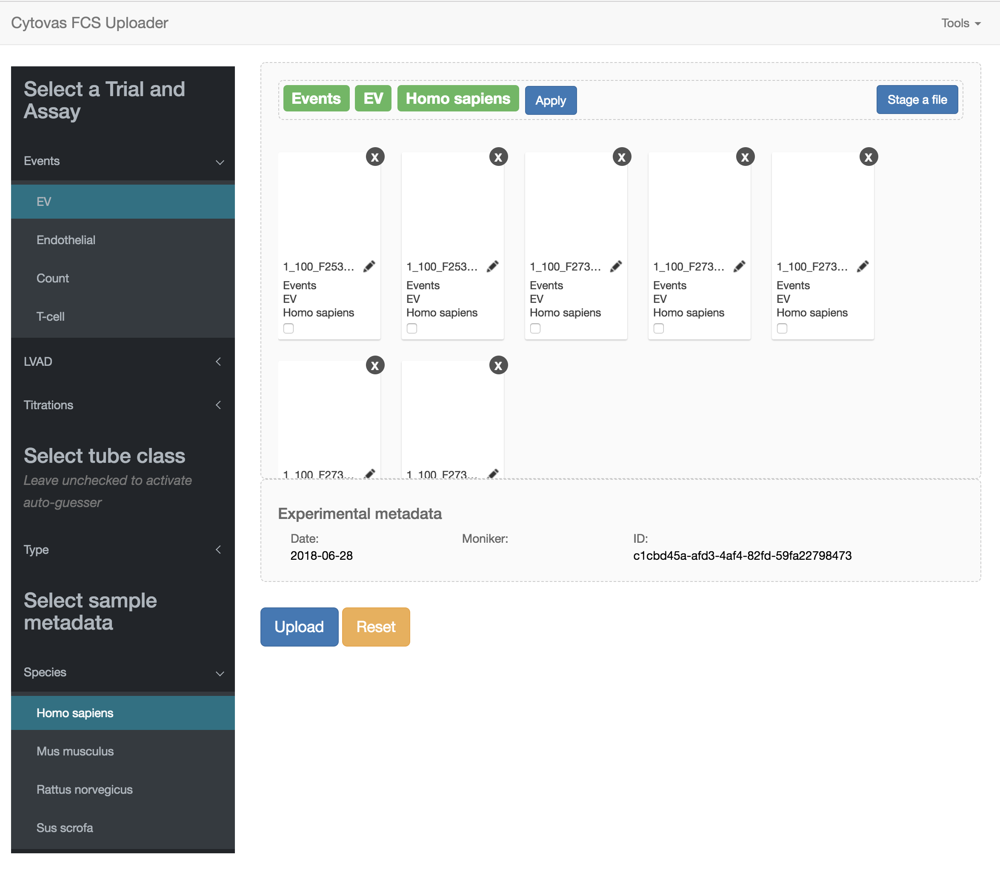
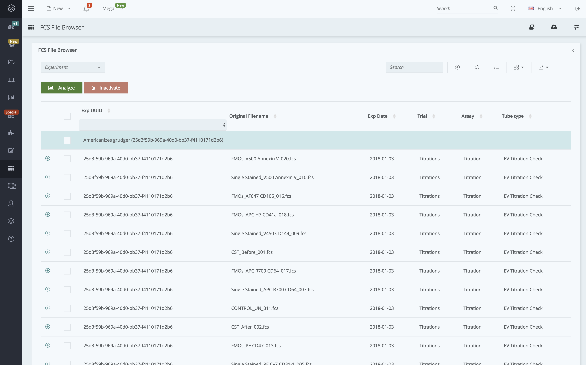

To have `npm install` work for the reactive template, fix the stupid swap problem (https://stackoverflow.com/questions/38127667/npm-install-ends-with-killed):
```
sudo /bin/dd if=/dev/zero of=/var/swap.1 bs=1M count=1024
sudo /sbin/mkswap /var/swap.1
sudo /sbin/swapon /var/swap.1
```

Other bullshit:
```
wget https://nodejs.org/dist/v8.5.0/node-v8.5.0-linux-x64.tar.xz
tar -xvf node-v8.5.0-linux-x64.tar.xz 
sudo cp bin/node /usr/bin/node
sudo mv lib/node_modules/npm /usr/lib/node_modules/
sudo npm install gulp-cli -g
npm install gulp -D
sudo npm install jspm -g
sudo npm install -g typescript@2.5.2
npm rebuild node-sass --force
```

To run reactive:
```
npm run serve.dev
```

https://stackoverflow.com/questions/25007130/how-to-use-grunt-gulp-with-pm2